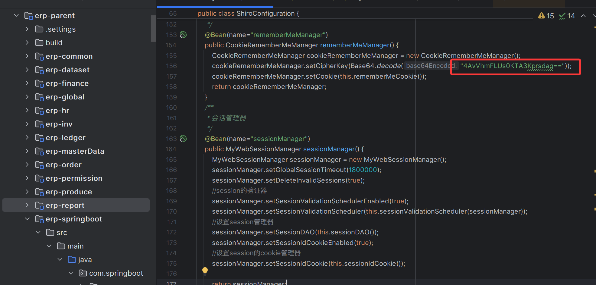
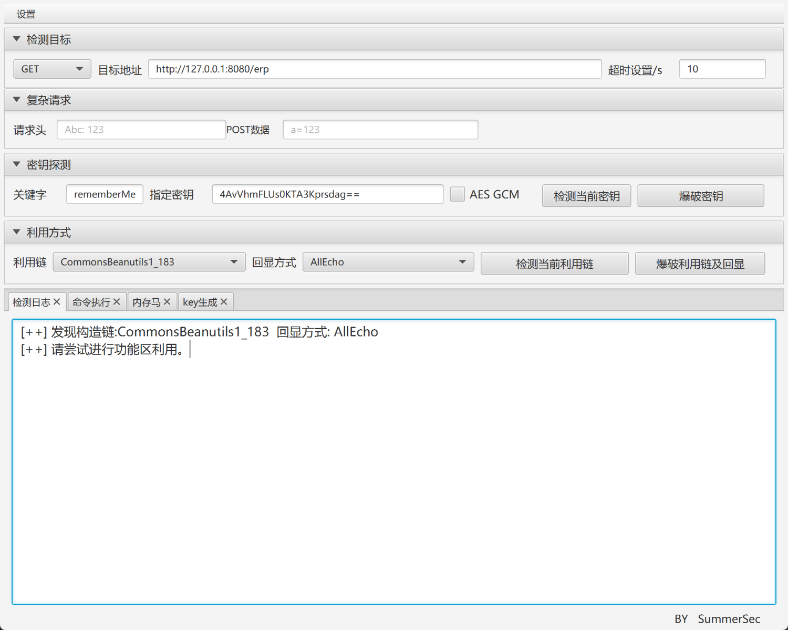
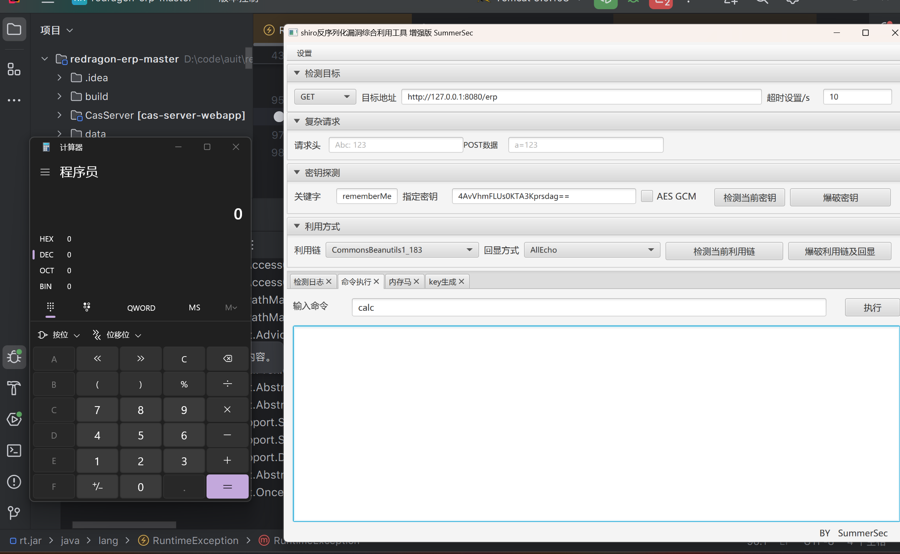

## [redragon-erp](https://gitee.com/redragon/redragon-erp) has a shiro deserialization vulnerability

Shiro key hardcoded：

Screenshot of successful exploitation (no output)：

This problem occurs when redragon-erp is started in SpringBoot mode.

